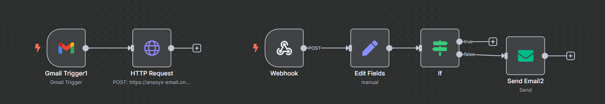

# 🤖 AI Email Response Agent

Một hệ thống tự động hoàn toàn giúp đọc email đến và tạo phản hồi thông minh bằng ngôn ngữ tự nhiên, sử dụng Gemini Pro. Dự án được xây dựng bằng **FastAPI** và **n8n** để tổ chức luồng công việc.

---

## 📌 Tính năng nổi bật

- Tự động kiểm tra hộp thư Gmail và lấy nội dung email mới.
- Sử dụng **Gemini Pro** để tạo phản hồi phù hợp theo ngữ cảnh.
- Gửi phản hồi trực tiếp đến người gửi email.
- Luôn hoạt động trực tuyến nhờ triển khai bằng **FastAPI** trên **Render**.
- Có thể mở rộng hoặc chỉnh sửa dễ dàng thông qua **n8n** hoặc các công cụ khác.

---

## 🖼️ Sơ đồ luồng xử lý với n8n

Dưới đây là hình ảnh sơ đồ xử lý trong **n8n**:

> 📌 *Lưu ý: hãy lưu ảnh sơ đồ n8n của bạn dưới tên `n8n-email-flow.png` và đặt vào thư mục `images` trong thư mục gốc của dự án.*

---

## 🛠️ Công nghệ sử dụng

| Thành phần     | Mô tả                                 |
|----------------|----------------------------------------|
| Python         | Ngôn ngữ lập trình chính               |
| FastAPI        | Xây dựng backend và endpoint xử lý    |
| n8n            | Thiết kế luồng công việc tự động       |
| Gemini Pro     | Mô hình ngôn ngữ dùng để phản hồi     |
| Render         | Dịch vụ triển khai agent trực tuyến    |

---

